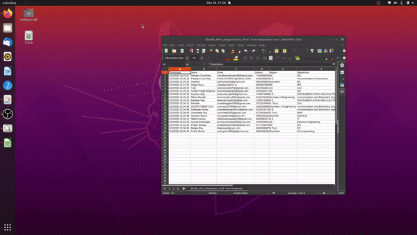
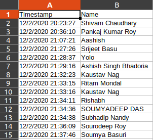
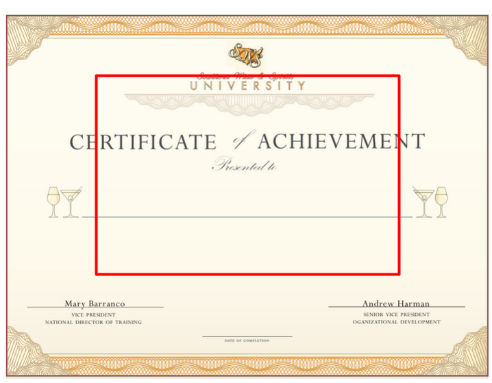

# certiClone : Generate Certificates in bulk

## Demo

## Fomat of certifictes
Pretty much any certificate template with a dash in the place of the name will work
For eg:

## Format of name list
The second column should have the names of the candidates
For eg:

## Working

Basically we take the image of the Certificate template and use simple image processing to detect horizontal lines (dash left for the name) in a ROI of the Template. This ROI in center part of the image where the names are mostly located in a certificate. So using the location of this line we fill in the name.

- Certificate ROI(Region of Interest)+

## Tech Stack

- OpenCV (Image Processing)
- Flask (API)
- Heroku (Deployment)
- Python (language)

## To Do
- Adding a React Front End
- NLP Analysis instead of simple image processing to support more certificate templates

