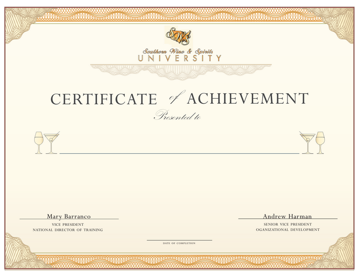

# certiClone : Generate Certificates in bulk

It is an app that takes in a certificate template (image) and a name list (csv) and generates copies for each name in the list.

The app is hosted here : https://certiclone.herokuapp.com/

## Demo

## Fomat of certifictes
Pretty much any certificate template with a dash in the place of the name will work
For eg:

## Format of name list
The second column should have the names of the candidates
For eg:

## Working

Basically we take the image of the Certificate template and use simple image processing to detect horizontal lines (dash left for the name) in a ROI of the Template. This ROI in center part of the image where the names are mostly located in a certificate. So using the location of this line we fill in the name.

- Certificate ROI(Region of Interest)

## Final Output
 ### Some Samples :
 

 ### File Output.zip :
 

## Tech Stack

- OpenCV (Image Processing)
- Flask (API)
- Heroku (Deployment)
- Python (language)

## To Do
- Adding a React Front End
- NLP Analysis instead of sample image processing to support more certificate templates

PS: I know that you can do this stuff using google slides, but with this you can desing the certificates using Photoshop, tbh i did this just as a practise projects, and yes it is one of the wiered 3 am ideas that got executed 🤣🤣 Cheers!!

Left some typos here so expecing some PRs
